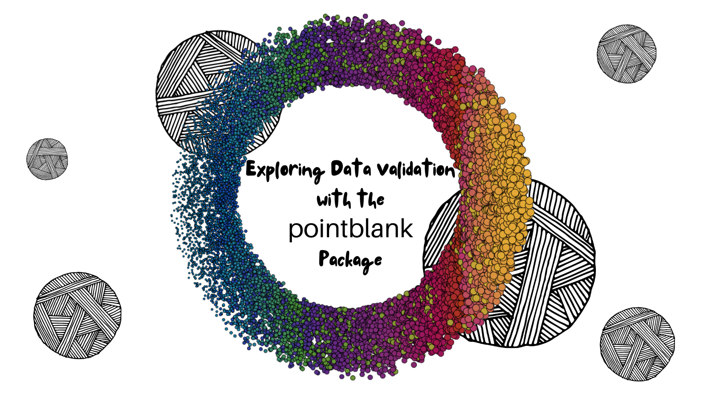

```{r, include = FALSE}
knitr::opts_chunk$set(
  collapse = TRUE,
  comment = "#>"
)
```

<center>




# Resources for "*Exploring Data Validation with the `pointblank` Package*

</center>

## About

This repository contains supplemental resources and materials that coincide with the [*Exploring Data Validation talk*](https://www.meetup.com/cleveland-user-group/events/284903377/) presented on Wednesday, October 12th for the Cleveland R User Meetup Group. This talk will provide information on what data validation is, why it's important, and how R users can begin using the [Rich Iannone](https://twitter.com/riannone) and Mauricio Vargas' [pointblank](https://rich-iannone.github.io/pointblank/) package to validate their own data in R.

## Presentation and Slides

The slides for this workshop can be viewed [here](https://meghansaha.github.io/exploring_validation/).

This presentation was recorded and is available on YouTube [here](https://t.co/181jd0X3e9).

## More Data Validation Resources

-   The [The `pointblank` Package](https://github.com/rich-iannone/pointblank) by [Rich Iannone](https://twitter.com/riannone)

-   The [`validate` package](https://github.com/data-cleaning/validate) and The [*Data Validation Cookbook*](https://data-cleaning.github.io/validate/) by [Mark van der Loo](http://www.markvanderloo.eu/)

-   [*A Lightweight Data Validation Ecosystem with R, GitHub, and Slack*](https://emilyriederer.netlify.app/post/data-valid-lightweight/) by [Emily Riederer](https://emilyriederer.netlify.app/about/)

-   The [`data.validator` package](https://github.com/Appsilon/data.validator) by [Appsilon](https://appsilon.com/)
